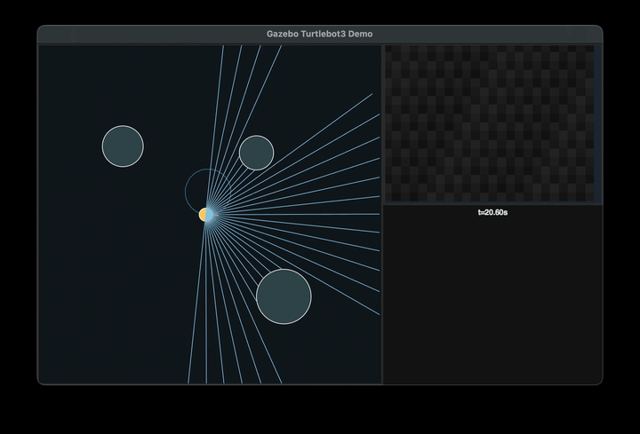

# AtlasForge Robotics

AtlasForge Robotics is an open, modular AI robotics stack for real robots and simulators. It blends autonomy, perception, and policy learning into a coherent pipeline with a strong emphasis on reproducibility and cross-platform support. The system is inspired by best practices from open autonomy stacks and robotics research, but it is built as a clean, extensible Python-first platform.
<a href="videos/demo_01.mp4"></a>

## Goals
- Provide a unified API for perception, planning, control, and policy learning.
- Make it easy to swap between real hardware and simulation backends.
- Support dataset-driven workflows, offline training, and on-robot evaluation.
- Ship with clear interfaces that enable custom robot adapters and sensors.

## Core Components
- **Core Runtime**: deterministic execution loops, data logging, and safety checks.
- **Perception & Mapping**: 2D/3D pipelines, sensor fusion, and map builders.
- **Planning & Control**: navigation, trajectory generation, and low-level control.
- **Policy Learning**: imitation + RL pipelines and replayable datasets.
- **Simulation Bridges**: adapters for ROS 2 + Gazebo, Isaac Sim, AirSim, and custom sims.

## Quick Start (placeholder)
```
python -m venv .venv
source .venv/bin/activate
pip install -e .
```

## Sample Dataset Logs
Generate a small JSONL log with sample sensor references:
```
./scripts/generate_sample_log.py --output-dir data/runs --run-id sample-run --steps 5
```
Logs are written to `data/runs/<run-id>.jsonl`.

## Gazebo-Style Demo (Local or ROS)
Run a lightweight Turtlebot3 loop with lidar + camera sensors, logging, a local GUI,
and a small web UI:
```
python scripts/run_gazebo_demo.py --duration 30 --run-id gazebo-demo
```
The web UI is served at `http://127.0.0.1:8080` while the demo runs.
Demo preview (click to watch the full video):
<a href="videos/demo_01.mp4"></a>
If the preview does not render, open `videos/demo_01.mp4` directly.

Auto-switch between a local mock and ROS by editing `config/sim/gazebo_demo.json`:
- `"backend": "mock"` uses the built-in simulation.
- `"backend": "ros"` connects to ROS 2 (Humble + Gazebo Classic is the most common).

ROS topics default to Turtlebot3 conventions:
`/cmd_vel`, `/odom`, `/scan`, `/camera/color/image_raw`.

### ROS 2 Humble + Gazebo Classic (Turtlebot3)
The most common ROS 2 stack for Turtlebot3 is **ROS 2 Humble** with **Gazebo Classic**.
Below is a typical launch flow (assuming a Turtlebot3 Burger):

```
# Terminal 1: source ROS and Turtlebot3
source /opt/ros/humble/setup.bash
export TURTLEBOT3_MODEL=burger
source ~/turtlebot3_ws/install/setup.bash

# Terminal 2: launch Gazebo Classic simulation
ros2 launch turtlebot3_gazebo turtlebot3_world.launch.py

# Terminal 3: run the AtlasForge demo in ROS mode
python scripts/run_gazebo_demo.py --backend ros
```

If your topics differ, edit `config/sim/gazebo_demo.json` under the `"ros"` section.

Troubleshooting:
- If `/api/state` shows empty sensors, confirm `/scan` and `/camera/color/image_raw` are publishing.
- If the robot does not move, confirm `/cmd_vel` is not remapped and `TURTLEBOT3_MODEL` is set.
- If you see `rclpy` import errors, re-source your ROS 2 environment and Turtlebot3 workspace.

## Attribution
If you use AtlasForge in a paper, demo, or product, please reference:
`https://github.com/MustafaAlpay/ai-robotics`

## License
GPL-3.0-or-later. See `LICENSE`.
